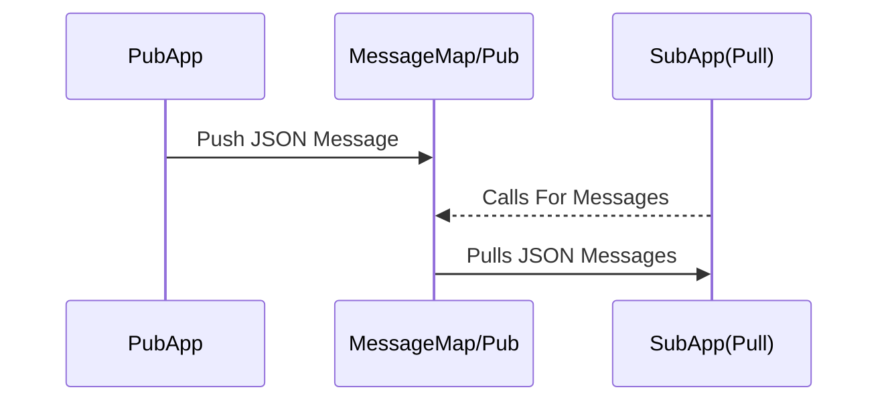
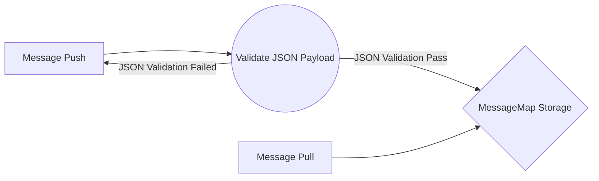
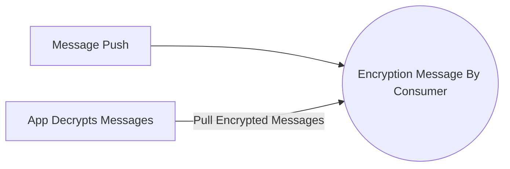
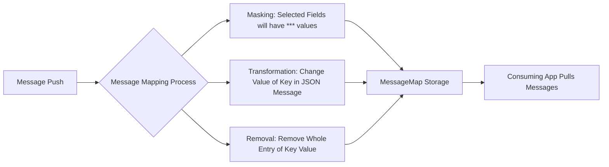
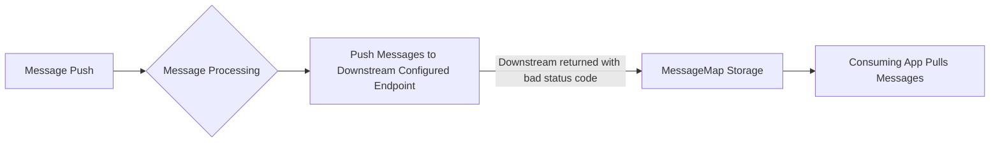

# Welcome to MessageMap.IO!

### Simple, Secure and Powerful Message Broker

*   Message Queue Pub/Sub
*   Subscribers Can Push or Pull From Message Queues
*   Message Transformation
*   Your Encryption Keys Per Subscriber
*   No Message expiration
*   Message Limited to Storage Limit
*   Message Topic Schema Validation

## How to Install

Requirements for MessageMap:
- Erlang version 20 - 24
- Min - Memory Usage of 1 GB
- Min - Hard Drive storage of 2 GB

Install Erlang for OS or from: https://www.erlang-solutions.com/downloads/

#### Install from RPM
```bash
# dnf install -y https://messagemap.ewr1.vultrobjects.com/messagemap-0.1.1-1.x86_64.rpm
```
#### Install from DEB
```bash
# wget https://messagemap.ewr1.vultrobjects.com/messagemap_0.1.1-1_amd64.deb -O /tmp/MessageMap.deb
# sudo dpkg -i /tmp/MessageMap.deb 
```
#### Install from Source Code
```bash
# ./rebar3 compile
# ./rebar3 shell
```

## How to Configure

All your files and folders are presented as a tree in the file explorer. You can switch from one to another by clicking a file in the tree.

## Usage of Application

Starting up the Application from source
```bash
# ./rebar3 shell
```
Starting up MessageMap from RPM and DEB install
```bash
# sudo systemctl enable messagemap.service
# sudo systemctl start messagemap.service
```

## License

GNU General Public License v3.0 or later

See [LICENSE](./LICENSE) to see the full text.

## Diagrams Structures

### Pub/Sub Application



### Pub/Sub Application with JSON Validation



### Pub/Sub Application with Encryption



### Pub/Sub Application with Message Transformation



### Pub/Sub Application with Push and Pull fallback


